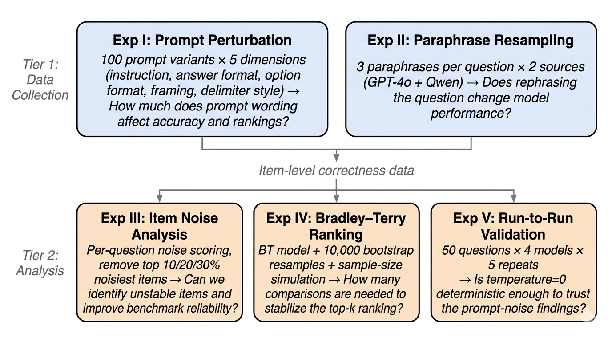

# Joint Decomposition of Prompt, Paraphrase, and Item-Level Noise in LLM Benchmark Evaluation

> Pengyu Li, Siyuan Teng, Tan Yang

## Overview

LLM leaderboards present benchmark scores as definitive, but their evaluations hide significant variance from prompt formatting, test-set wording, and item-level instability. This project provides the **first joint decomposition** of these three noise sources on ARC-Challenge and MMLU-Pro across four instruction-tuned models (7B–72B), comprising **131,600 API calls** across five experiments.



## Key Findings

- **Prompt formatting dominates** evaluation noise (58–94% of variance), with answer format alone explaining >70%
- **Paraphrase noise is tenfold smaller**, contributing <8% of total variance
- **Larger models are not uniformly robust**: Qwen2.5-72B is the most paraphrase-stable yet the most prompt-sensitive on ARC (33.3pp range)
- **Reliable top-1 ranking requires ~2,000 pairwise comparisons** under Bradley-Terry
- **Run-to-run API stochasticity** at temperature zero accounts for less than half of prompt-induced noise

## Repository Structure

```
├── exp1/                              # Experiment I: Prompt Perturbation
│   ├── prompt_variants.py             # 100-variant design (5 dimensions)
│   ├── run_experiment1.py             # API runner (2-phase async pipeline)
│   ├── analyze_experiment1.py         # Variance decomposition & OLS
│   ├── visualize_experiment1.py       # Figure generation
│   ├── arc_challenge_300.json         # ARC-Challenge dataset
│   ├── mmlu_pro_300.json              # MMLU-Pro dataset
│   ├── results_exp1/                  # Raw API responses (8 JSON files)
│   └── analysis_exp1/                 # Analysis outputs
│
├── exp2/                              # Experiment II: Paraphrase Resampling
│   ├── generate_paraphrases_gpt4o.py  # Dual-source paraphrase generation
│   ├── run_experiment2_async.py       # API runner
│   ├── analyze_experiment2.py         # Bootstrap significance tests
│   ├── visualize_experiment2.py       # Figure generation
│   ├── *_paraphrased_*.json           # Generated paraphrases
│   ├── exp2_*.json                    # Raw results (16 JSON files)
│   ├── analysis_exp2/                 # Analysis outputs
│   └── qc/                            # Paraphrase quality validation
│       ├── manual_qc_50.py            # 50-sample manual QC
│       ├── semantic_faithfulness.py   # Bidirectional NLI (1,800 paraphrases)
│       └── *.json, *.csv              # QC results
│
├── exp3/                              # Experiment III: Noise Item Analysis
│   ├── run_experiment3.py             # Per-question noise score computation
│   ├── analyze_experiment3.py         # Threshold sweep analysis
│   ├── visualize_experiment3.py       # Figure generation
│   ├── noise_data/                    # Noise scores
│   └── analysis_exp3/                 # Analysis outputs
│
├── exp4/                              # Experiment IV: Bradley-Terry Ranking
│   ├── run_bradley_terry.py           # BT MLE + bootstrap + simulation
│   ├── visualize_bt.py                # Figure generation
│   └── bt_results_*.json              # BT log-strengths and posteriors
│
├── exp5/                              # Experiment V: Run-to-Run Stability
│   ├── run_stability.py               # 2,000-trial repeated runs
│   ├── analyze_stability.py           # TARr@5 and disagreement ratio
│   ├── results_exp5/                  # Raw stability trials
│   └── analysis_exp5/                 # Analysis outputs
│
└── figures/                           # All figures
    ├── generate_report_figures.py     # Main text figures
    ├── generate_appendix_figures.py   # Appendix figures
    ├── generate_ols_stats.py          # OLS F-tests and Q-Q diagnostics
    ├── fig4_prompt_vs_paraphrase.py   # Exp II comparison figure
    └── *.png                          # Generated figures (15 files)
```

## Reproducing the Experiments

### Prerequisites

```bash
pip install httpx numpy scipy statsmodels matplotlib
export OPENROUTER_API_KEY="your-key-here"
```

### Running Each Experiment

```bash
# Experiment I: Prompt Perturbation (120,000 API calls)
python exp1/run_experiment1.py
python exp1/analyze_experiment1.py

# Experiment II: Paraphrase Resampling (9,600 API calls)
python exp2/generate_paraphrases_gpt4o.py
python exp2/run_experiment2_async.py
python exp2/analyze_experiment2.py
python exp2/qc/manual_qc_50.py
python exp2/qc/semantic_faithfulness.py

# Experiment III: Noise Analysis (reuses Exp I+II data)
python exp3/run_experiment3.py --shared-only
python exp3/analyze_experiment3.py --noise-tag _shared150

# Experiment IV: Bradley-Terry Ranking
python exp4/run_bradley_terry.py

# Experiment V: Run-to-Run Validation (2,000 API calls)
python exp5/run_stability.py
python exp5/analyze_stability.py

# Generate figures
python figures/generate_report_figures.py
python figures/generate_appendix_figures.py
```

All scripts use `temperature=0.0` and `seed=42` via the OpenRouter API.
